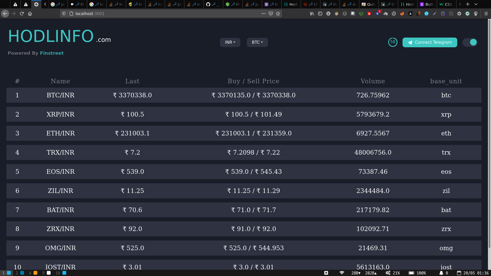

# wazirix-api
Get started:

#### clone the git repoitory to your desired path in your file system.
#### run 'npm install' command.
#### run 'npm start' command.

## NOTE: node app.js or nodemon app.js will not work as this program requires certain parameters to be passed upon running node. Kindly start the app with 'npm start' 

